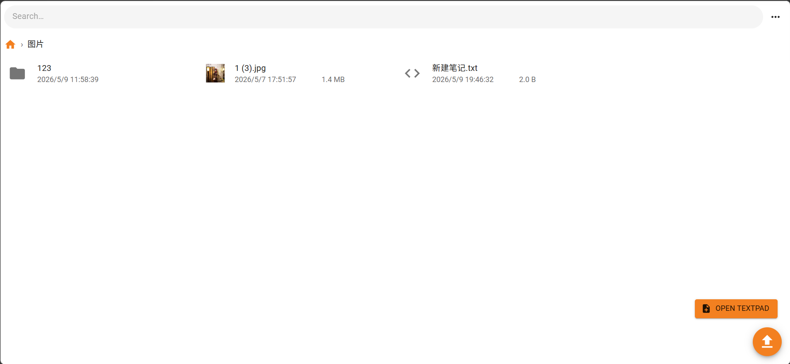
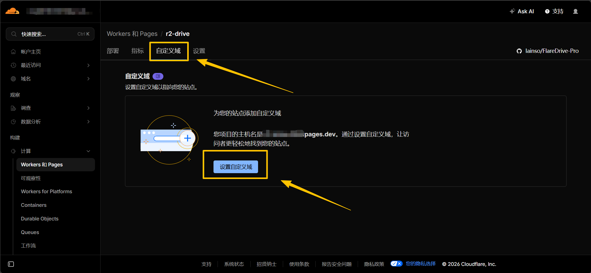
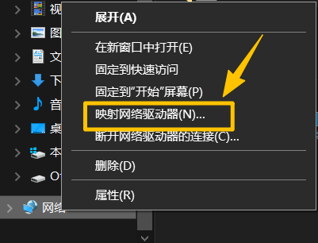
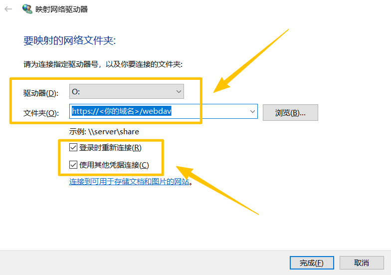

# FlareDrive-Pro

基于 Cloudflare 大爹施舍的 Pages 服务和 R2 对象存储做的网盘。免费套餐包含 
[每 30 天平均峰值 10GB 的存储空间，外加 100w 次修改操作和 1000w 次查询操作](https://developers.cloudflare.com/r2/platform/pricing/)。

这是一个基于 [longern/FlareDrive](https://github.com/longern/FlareDrive) 的加强版项目，主要做了汉化和样式美化，以及新增了一些功能。喜欢的话别忘了给原作者也点个 Star 哦😘

原版：

本项目：

## 原项目功能

- 上传/下载/删除/重命名/分享文件
- WebDAV 客户端支持
- 拖拽上传
- 创建文件夹
- 在线笔记本
- 搜索文件
- 缩略图预览

## 本项目修改

- 汉化原项目
- 美化 Web 页面
- 修复并新增文件正反排序（时间、大小、名称）
- 修复并优化列表/网格排布
- 实现兼容 Windows Webdav
- 新增 Web 端上传多线程支持（默认5线程）与提示
- 新增下载/分享链接 Token 校验机制，防止文件路径爆破

## 前置要求

- 一个已开通 R2 服务的 Cloudflare 账号

🔐 R2 的开通可以通过 Paypal 绑定银联卡完成

## 部署指南

[点击此处查看](public/doc/Deploy.md)

## 进阶配置

### 自定义访问域名

切换到项目首页，切换到「自定义域」进行配置。自定义的域名通常需要几分钟生效，最长需要 48 小时。

### 挂载到 Windows 上访问

1. 打开资源管理器，右键选择「映射网络驱动器」。

2. 填写信息并确保两个选项都已勾选。

3. 点击完成后输入设置的账号密码即可。挂载后可直接在「此电脑」上进行文件管理。

### 调用 WebDAV

你可以使用任何支持 WebDAV 协议的客户端来访问您的文件。
接口地址填写为 `https://<你的域名>/webdav`，用户名和密码使用您在环境变量中设置的值。

⚠️ 注意：由于 Cloudflare Workers 的限制，标准 WebDAV 协议不支持上传大文件（≥128MB）。
如需上传大文件，请通过网页或者S3 Browser等第三方客户端进行分块上传。

## 致谢

[longern 的 FlareDrive 原始项目](https://github.com/longern/FlareDrive) 

[Gemini 3.1 Pro Preview](https://aistudio.google.com/) 