## 部署步骤

1. 前往 Cloudflare R2 控制台，新建存储桶。

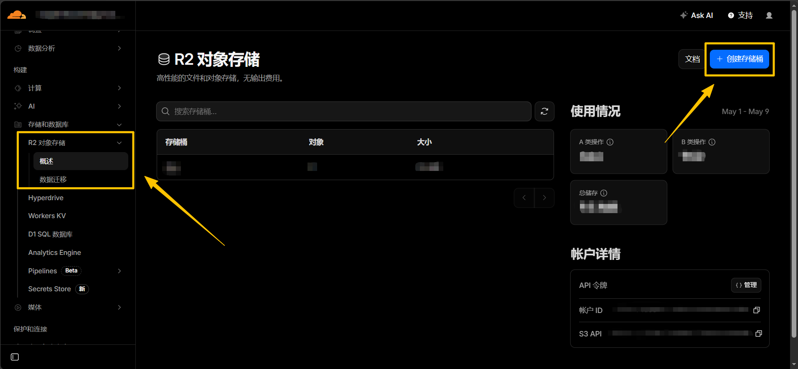

2. Fork 本项目仓库到你的 GitHub

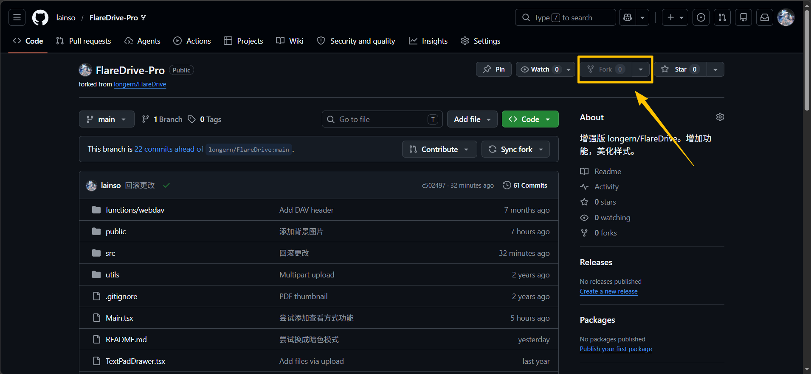

3. 打开 Cloudflare Pages，创建一个 Pages。

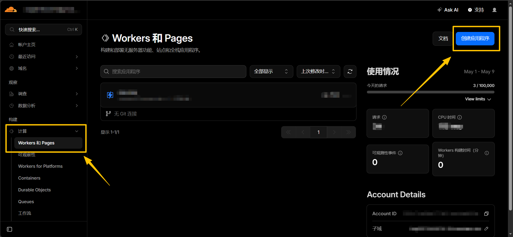

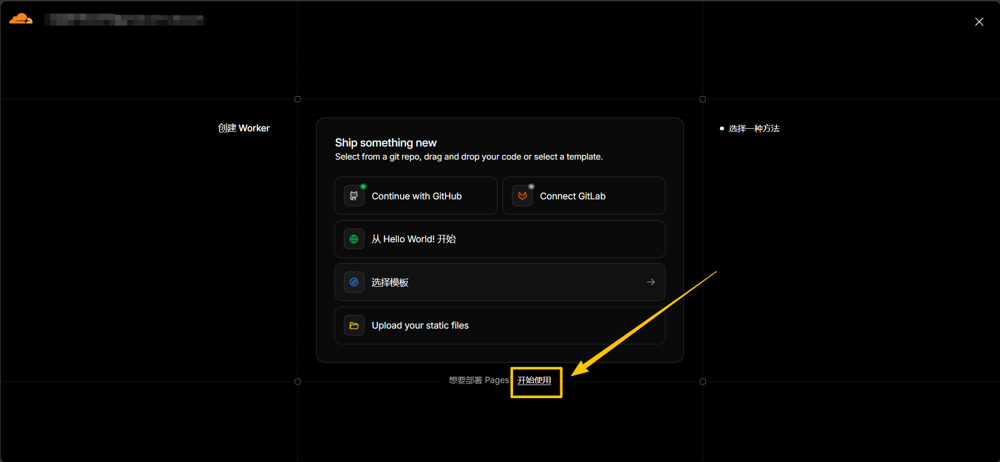

4. 选择「导入现有 Git 存储库」并选择你 Fork 出来的仓库

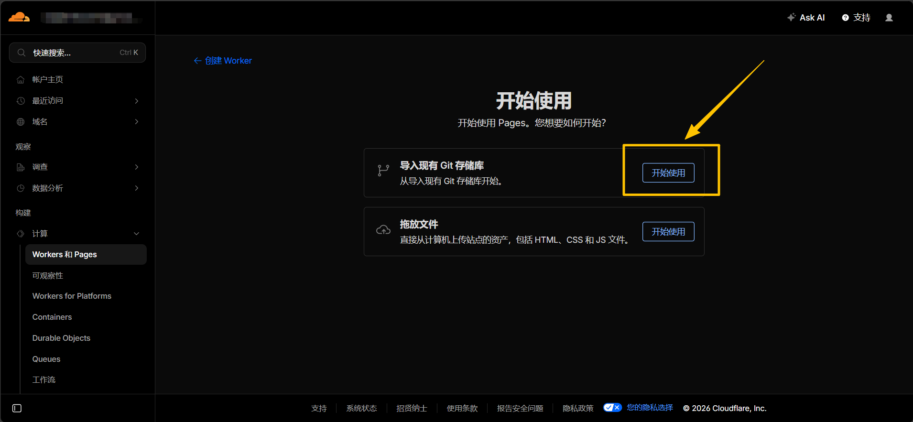

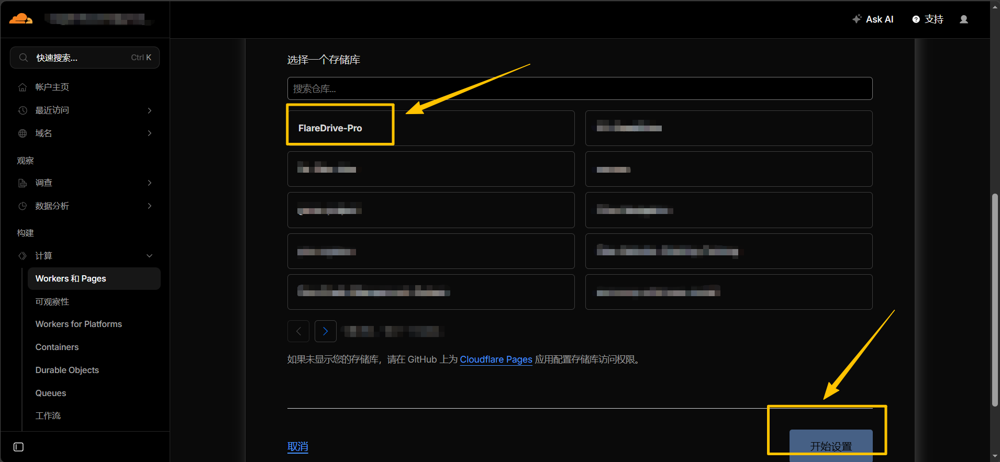

5. 输入你喜欢的项目名称，然后选择 `Docusaurus` 框架

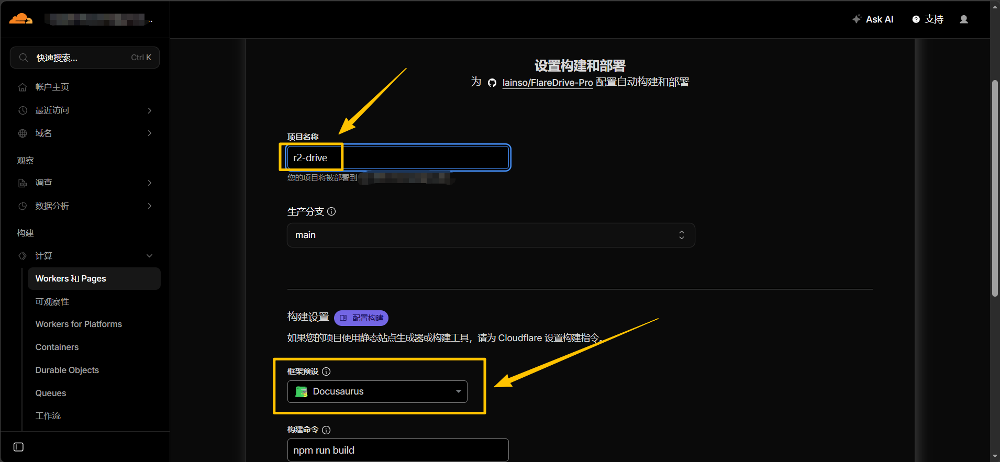

6. 展开 「环境变量（高级）」，添加以下环境变量：

| 变量名称               | 值  | 备注                 | 是否必填 |
|--------------------|----|--------------------|------|
| WEBDAV_USERNAME    | 任意 | 登录账号               | 是    |
| WEBDAV_PASSWORD    | 任意 | 登录密码               | 是    |
| WEBDAV_PUBLIC_READ | 1  | 加入这个环境变量代表启用公开读取权限 | 否    |

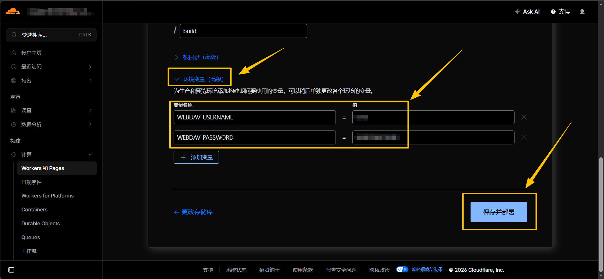

  ⚠️ 请勿开启 R2 存储桶的公开写入权限！否则你的存储资源可能会被恶意刷爆。

7. 点击「保存并部署」，然后稍等几分钟。

8. 点击「继续处理项目」，切换到「设置」 - 「绑定」。

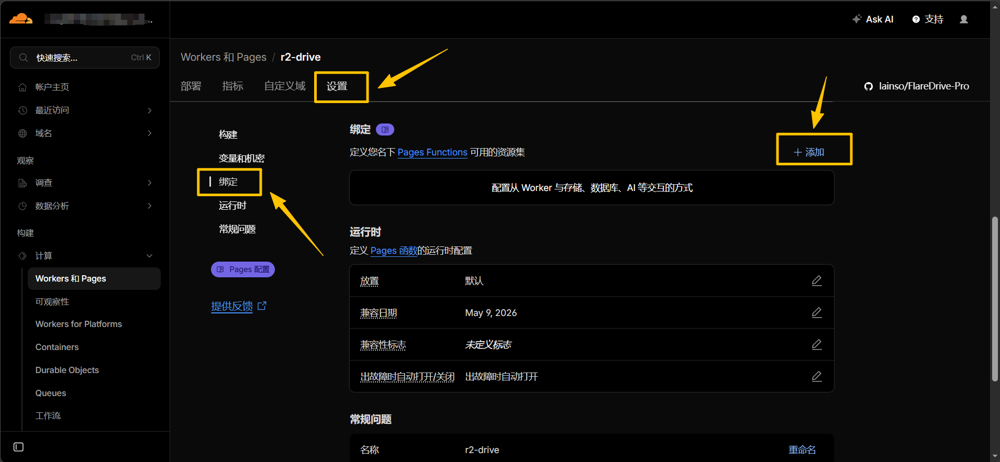

9. 点击添加，下拉找到「R2存储桶」，变量名称填写 `BUCKET`，然后选择刚才创建的存储桶并保存。

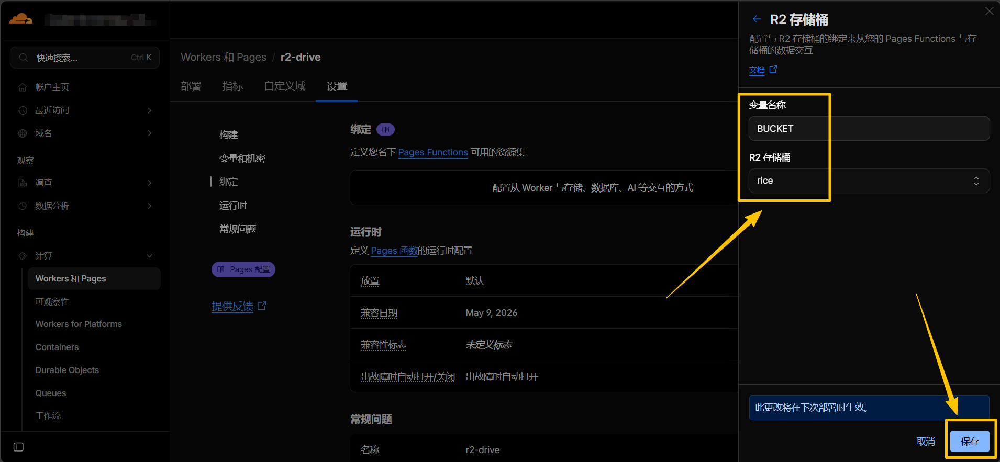

10. 回到「部署」，点击「...」,选择「重试部署」并等待几分钟。直到状态显示成功。

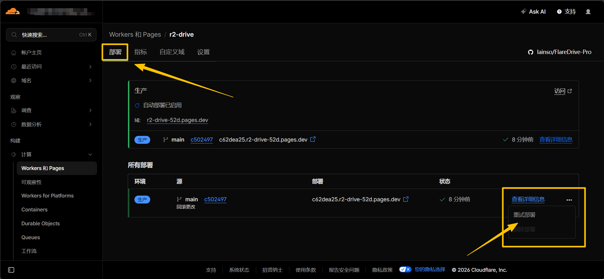

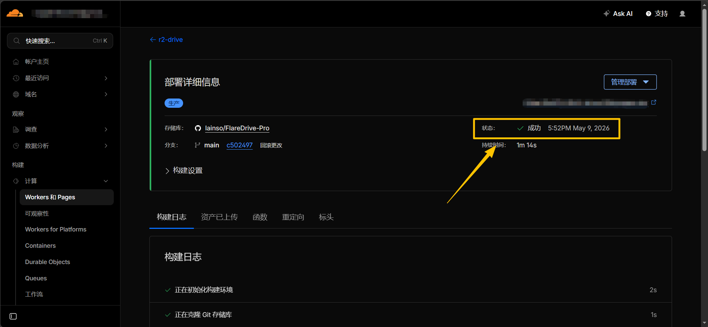

11. 点击右上角的网站，输入账号密码即可访问网盘。

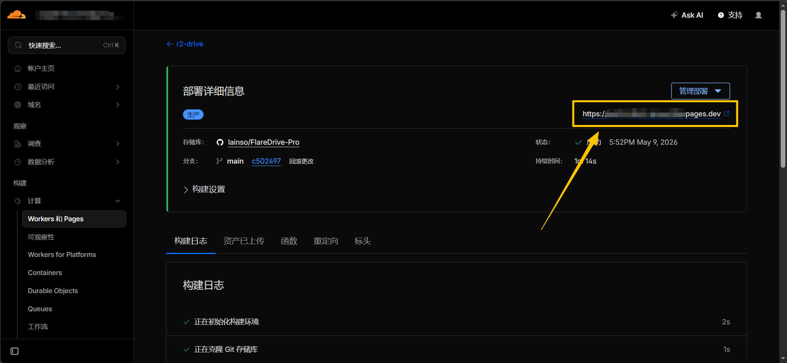

